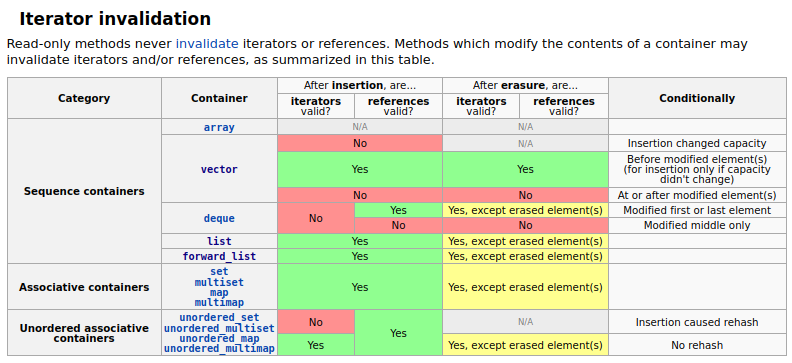

Data structures
===============

Stack
-----
```
template<
    class T,
    class Container = std::deque<T>
> class stack;
```  
**Stack** is a linear data structure that follows the Last-In, First-Out (LIFO) principle.  
The class template acts as a wrapper to the underlying container - only a specific set of functions is provided.  
The stack `pushes and pops the element from the back of the underlying container`, known as the top of the stack.  
  
**Operations:**
- push() (add to top)
- pop() (remove from top)
- top() (access top element without removing)
- empty()
- size().
  
C++ STL: std::stack is a container adaptor that can use std::deque, std::list, or std::vector as its underlying container.  
By default, if no container class is specified for a particular stack class instantiation, the standard container **std::deque** is used.  
  
Queue
------
```
template<
    class T,
    class Container = std::deque<T>
> class queue;
```  
**Queue** is a linear data structure that follows the First-In, First-Out (FIFO) principle.  
The class template acts as a wrapper to the underlying container - only a specific set of functions is provided.  
The queue `pushes the elements on the back of the underlying container and pops them from the front`.  
  
**Operations:**
- push() (add to rear)
- pop() (remove from front)
- front() (access front element)
- back() (access rear element)
- empty()
- size()
  
C++ STL: std::queue is a container adaptorthat can use std::deque, std::list as its underlying container.  
By default, if no container class is specified for a particular stack class instantiation, the standard container **std::deque** is used.  
std::priority_queue is also available for ordered queues.  
  
List
=====
```
template<
    class T,
    class Allocator = std::allocator<T>
> class list;
```
**List** is a container that supports constant time insertion and removal of elements from anywhere in the container.  
Fast random access is not supported.  
It is usually implemented as a doubly-linked list.  
**std::list** provides **bidirectional** iteration capability (less space efficientstorage).  
**std::forward_list** provides **unidirectional** iteration capability (more space efficient storage).  
  
Adding, removing and moving the elements within the list or across several lists does not invalidate the iterators or references. An iterator is invalidated only when the corresponding element is deleted.  
  
**Operations:**
- push_back()
- pop_back()
- push_front()
- pop_front()
- empty()
- size()
  
Arrays/Vectors
--------------
```
template<
    class T,
    class Allocator = std::allocator<T>
> class vector;
```
Elements of the same type are stored contiguously, which means that elements can be accessed not only through iterators, but also using offsets to regular pointers to elements.  
This means that a pointer to an element of a vector may be passed to any function that expects a pointer to an element of an array.  
**Vectors** usually occupy more space than static arrays, because more memory is allocated to handle future growth.  
This way a **vector** does not need to reallocate each time an element is inserted, but only when the additional memory is exhausted. The total amount of allocated memory can be queried using **capacity()** function. Extra memory can be returned to the system via a call to **shrink_to_fit()**.  
  
C++ STL: std::vector is a dynamic array that can resize itself. std::array is a fixed-size array.  
  
Hash Maps
---------
**A hash map** (also known as a hash table or **dictionary**) is an associative data structure that stores key-value pairs. It uses a hash function to map keys to indices in an array, providing fast average-case time complexity for insertions, deletions, and lookups.  
  
C++ STL: std::unordered_map provides a hash map implementation. It does not maintain any specific order of elements. For ordered key-value pairs, std::map (based on balanced binary search trees) is used.  

Iterator invalidation
---------------------



C++ Standard Template Library Quick Reference
---------------------------------------------
https://alyssaq.github.io/stl-complexities/